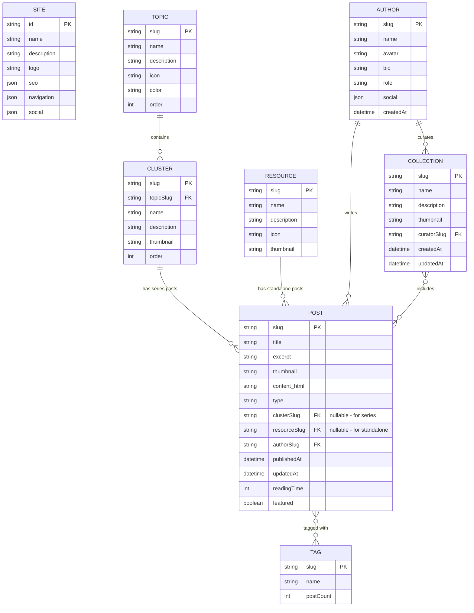
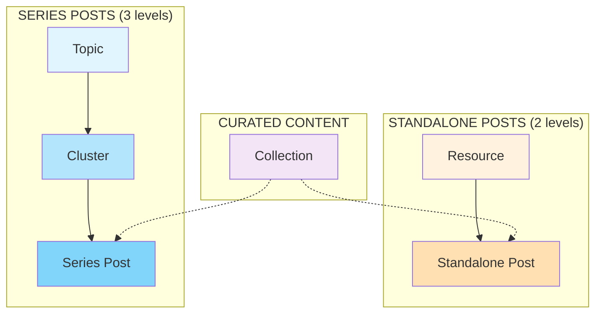
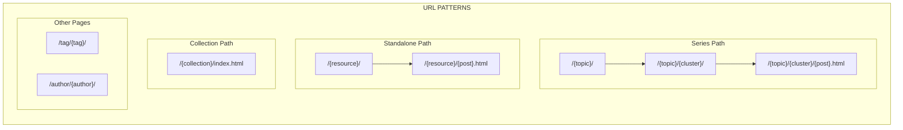
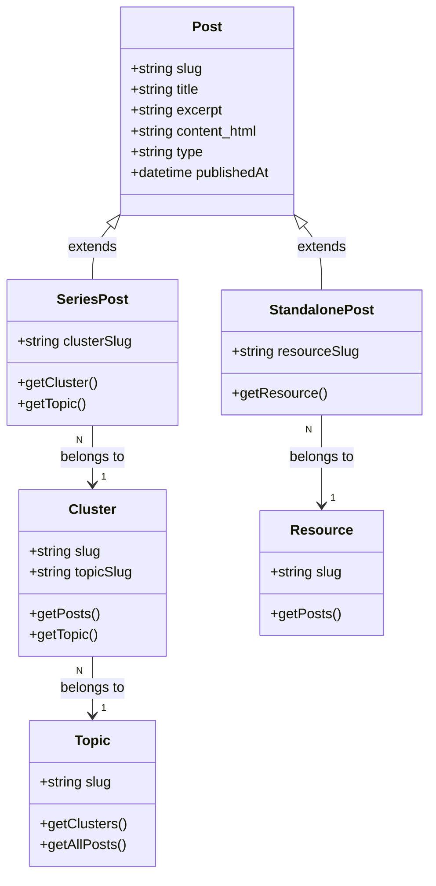
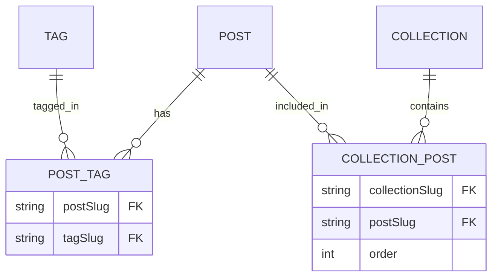
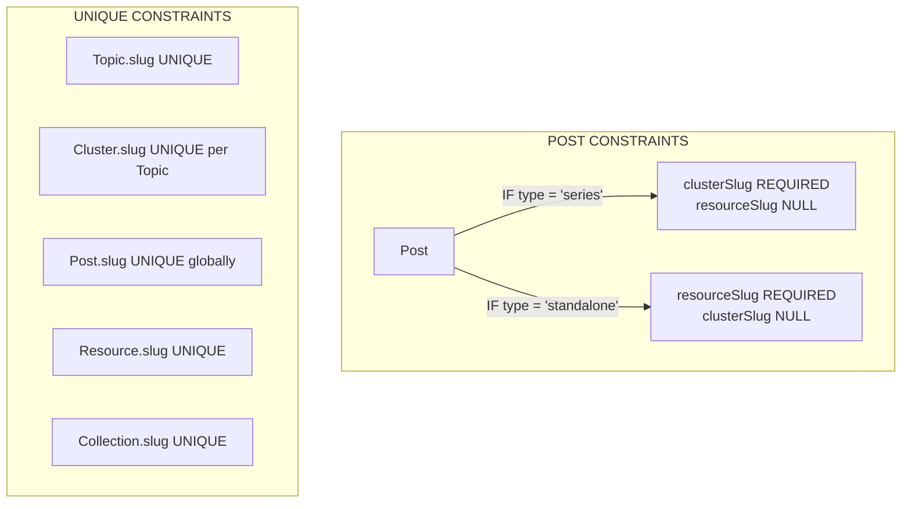
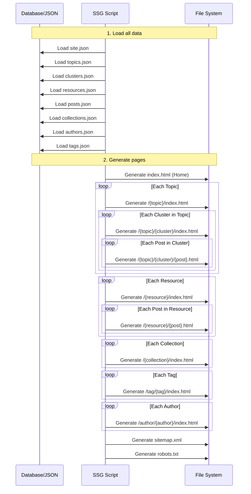
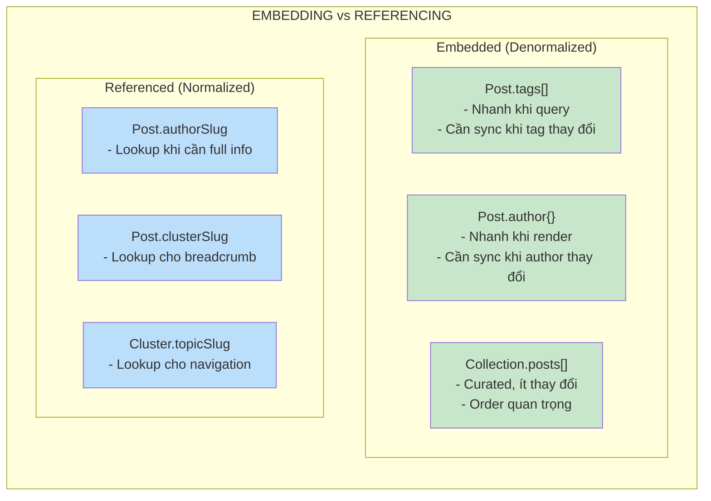

# Sơ đồ EER (Enhanced Entity-Relationship)

## Tổng quan mối quan hệ



## Chi tiết các mối quan hệ

### 1. Phân cấp Nội dung (Content Hierarchy)



### 2. URL Pattern theo Entity



### 3. Post Types & Relationships



### 4. Many-to-Many Relationships



## Bảng tóm tắt quan hệ

| Entity A | Relationship | Entity B | Cardinality | Mô tả |
|----------|-------------|----------|-------------|-------|
| Topic | contains | Cluster | 1:N | Mỗi Topic có nhiều Cluster |
| Cluster | has | Post (series) | 1:N | Mỗi Cluster có nhiều bài viết series |
| Resource | has | Post (standalone) | 1:N | Mỗi Resource có nhiều bài viết standalone |
| Author | writes | Post | 1:N | Mỗi Author viết nhiều bài |
| Author | curates | Collection | 1:N | Mỗi Author có thể tạo nhiều Collection |
| Post | tagged_with | Tag | M:N | Bài viết có nhiều tag, tag gắn nhiều bài |
| Collection | includes | Post | M:N | Collection chứa nhiều bài, bài nằm trong nhiều collection |

## Entity Constraints



## Data Flow khi Generate Static Site



## Physical Schema (MongoDB)

### Collection Structure

```javascript
// ===== SITE COLLECTION =====
// Collection: site (singleton - chỉ 1 document)
{
  _id: "main",
  name: "Tech Blog",
  description: "Blog công nghệ",
  logo: "/images/logo.svg",
  seo: {
    title: "Tech Blog - Chia sẻ kiến thức công nghệ",
    description: "...",
    keywords: ["tech", "programming"]
  },
  navigation: {
    main: [
      { label: "Trang chủ", url: "/" },
      { label: "DevOps", url: "/devops/" }
    ],
    footer: [...]
  },
  social: {
    facebook: "https://facebook.com/techblog",
    twitter: "https://twitter.com/techblog"
  }
}

// ===== AUTHORS COLLECTION =====
// Collection: authors
{
  _id: ObjectId("..."),
  slug: "nguyen-van-a",           // unique index
  name: "Nguyễn Văn A",
  avatar: "/images/authors/nguyen-van-a.jpg",
  bio: "Senior Developer với 10 năm kinh nghiệm",
  role: "Senior Developer",
  social: {
    twitter: "https://twitter.com/nguyenvana",
    github: "https://github.com/nguyenvana",
    linkedin: "https://linkedin.com/in/nguyenvana"
  },
  createdAt: ISODate("2024-01-15T00:00:00Z")
}

// ===== TOPICS COLLECTION =====
// Collection: topics
{
  _id: ObjectId("..."),
  slug: "devops",                 // unique index
  name: "DevOps",
  description: "CI/CD, Docker, Kubernetes và Cloud",
  icon: "🚀",
  color: "#FF6B6B",
  order: 1
}

// ===== CLUSTERS COLLECTION =====
// Collection: clusters
{
  _id: ObjectId("..."),
  slug: "docker-co-ban",          // unique index
  topicSlug: "devops",            // reference to topics
  name: "Docker cơ bản",
  description: "Học Docker từ A-Z",
  thumbnail: "/images/clusters/docker.jpg",
  order: 1,
  
  // Denormalized for quick access (optional)
  topic: {
    slug: "devops",
    name: "DevOps"
  }
}

// ===== RESOURCES COLLECTION =====
// Collection: resources
{
  _id: ObjectId("..."),
  slug: "podcast",                // unique index
  name: "Podcast",
  description: "Podcast về công nghệ",
  icon: "🎙️",
  thumbnail: "/images/resources/podcast.jpg"
}

// ===== POSTS COLLECTION =====
// Collection: posts
{
  _id: ObjectId("..."),
  slug: "docker-la-gi",           // unique index
  title: "Docker là gì? Tại sao nên dùng Docker?",
  excerpt: "Tìm hiểu Docker từ cơ bản đến nâng cao...",
  thumbnail: "/images/posts/docker-la-gi.jpg",
  content_html: "<article>...</article>",
  
  // Post type discriminator
  type: "series",                 // "series" | "standalone"
  
  // For series posts (type = "series")
  clusterSlug: "docker-co-ban",
  
  // For standalone posts (type = "standalone")  
  resourceSlug: null,
  
  // Author reference
  authorSlug: "nguyen-van-a",
  
  // Tags - embedded array (M:N denormalized)
  tags: [
    { slug: "docker", name: "Docker" },
    { slug: "devops", name: "DevOps" },
    { slug: "container", name: "Container" }
  ],
  
  // Timestamps
  publishedAt: ISODate("2024-03-15T10:00:00Z"),
  updatedAt: ISODate("2024-03-20T14:30:00Z"),
  
  // Metadata
  readingTime: 8,
  featured: true,
  
  // Denormalized for quick access (optional)
  author: {
    slug: "nguyen-van-a",
    name: "Nguyễn Văn A",
    avatar: "/images/authors/nguyen-van-a.jpg"
  },
  cluster: {
    slug: "docker-co-ban",
    name: "Docker cơ bản",
    topicSlug: "devops"
  },
  topic: {
    slug: "devops",
    name: "DevOps"
  }
}

// ===== TAGS COLLECTION =====
// Collection: tags
{
  _id: ObjectId("..."),
  slug: "docker",                 // unique index
  name: "Docker",
  postCount: 15                   // computed/updated field
}

// ===== COLLECTIONS COLLECTION =====
// Collection: collections (curated lists)
{
  _id: ObjectId("..."),
  slug: "best-docker-articles",   // unique index
  name: "Bài viết Docker hay nhất",
  description: "Tuyển tập các bài viết Docker được đọc nhiều nhất",
  thumbnail: "/images/collections/docker-best.jpg",
  curatorSlug: "nguyen-van-a",
  
  // Embedded posts list with order (M:N denormalized)
  posts: [
    {
      slug: "docker-la-gi",
      title: "Docker là gì?",
      thumbnail: "/images/posts/docker-la-gi.jpg",
      order: 1
    },
    {
      slug: "dockerfile-best-practices",
      title: "Dockerfile Best Practices",
      thumbnail: "/images/posts/dockerfile.jpg",
      order: 2
    }
  ],
  
  // Denormalized curator info
  curator: {
    slug: "nguyen-van-a",
    name: "Nguyễn Văn A",
    avatar: "/images/authors/nguyen-van-a.jpg"
  },
  
  createdAt: ISODate("2024-06-01T00:00:00Z"),
  updatedAt: ISODate("2024-06-15T00:00:00Z")
}
```

### Indexes

```javascript
// ===== INDEXES =====

// Authors
db.authors.createIndex({ slug: 1 }, { unique: true })

// Topics
db.topics.createIndex({ slug: 1 }, { unique: true })
db.topics.createIndex({ order: 1 })

// Clusters
db.clusters.createIndex({ slug: 1 }, { unique: true })
db.clusters.createIndex({ topicSlug: 1, order: 1 })

// Resources
db.resources.createIndex({ slug: 1 }, { unique: true })

// Posts - Main indexes
db.posts.createIndex({ slug: 1 }, { unique: true })
db.posts.createIndex({ type: 1 })
db.posts.createIndex({ clusterSlug: 1, publishedAt: -1 })
db.posts.createIndex({ resourceSlug: 1, publishedAt: -1 })
db.posts.createIndex({ authorSlug: 1, publishedAt: -1 })
db.posts.createIndex({ "tags.slug": 1, publishedAt: -1 })
db.posts.createIndex({ publishedAt: -1 })
db.posts.createIndex({ featured: 1, publishedAt: -1 })

// Tags
db.tags.createIndex({ slug: 1 }, { unique: true })
db.tags.createIndex({ postCount: -1 })

// Collections
db.collections.createIndex({ slug: 1 }, { unique: true })
db.collections.createIndex({ curatorSlug: 1 })
```

### Common Queries

```javascript
// ===== COMMON QUERIES =====

// 1. Get all posts in a cluster (for cluster page)
db.posts.find({ 
  clusterSlug: "docker-co-ban",
  type: "series"
}).sort({ publishedAt: -1 })

// 2. Get all posts in a resource (for resource page)
db.posts.find({ 
  resourceSlug: "podcast",
  type: "standalone"
}).sort({ publishedAt: -1 })

// 3. Get posts by tag (for tag page)
db.posts.find({ 
  "tags.slug": "docker" 
}).sort({ publishedAt: -1 })

// 4. Get posts by author (for author page)
db.posts.find({ 
  authorSlug: "nguyen-van-a" 
}).sort({ publishedAt: -1 })

// 5. Get featured posts (for home page)
db.posts.find({ 
  featured: true 
}).sort({ publishedAt: -1 }).limit(5)

// 6. Get latest posts (for home page)
db.posts.find({}).sort({ publishedAt: -1 }).limit(10)

// 7. Get all clusters in a topic (for topic page)
db.clusters.find({ 
  topicSlug: "devops" 
}).sort({ order: 1 })

// 8. Get post with full details (for post page)
db.posts.findOne({ slug: "docker-la-gi" })

// 9. Get related posts (same cluster, exclude current)
db.posts.find({ 
  clusterSlug: "docker-co-ban",
  slug: { $ne: "docker-la-gi" }
}).sort({ publishedAt: -1 }).limit(5)

// 10. Aggregate: Count posts per tag
db.posts.aggregate([
  { $unwind: "$tags" },
  { $group: { 
    _id: "$tags.slug", 
    name: { $first: "$tags.name" },
    count: { $sum: 1 } 
  }},
  { $sort: { count: -1 }}
])

// 11. Full-text search
db.posts.createIndex({ title: "text", excerpt: "text", content_html: "text" })
db.posts.find({ $text: { $search: "docker container" }})
```

### Schema Validation (Optional)

```javascript
// ===== SCHEMA VALIDATION =====

db.createCollection("posts", {
  validator: {
    $jsonSchema: {
      bsonType: "object",
      required: ["slug", "title", "content_html", "type", "authorSlug", "publishedAt"],
      properties: {
        slug: { bsonType: "string" },
        title: { bsonType: "string" },
        type: { enum: ["series", "standalone"] },
        clusterSlug: { bsonType: ["string", "null"] },
        resourceSlug: { bsonType: ["string", "null"] },
        authorSlug: { bsonType: "string" },
        tags: {
          bsonType: "array",
          items: {
            bsonType: "object",
            required: ["slug", "name"],
            properties: {
              slug: { bsonType: "string" },
              name: { bsonType: "string" }
            }
          }
        }
      },
      // Custom validation: series must have clusterSlug, standalone must have resourceSlug
      oneOf: [
        {
          properties: { type: { const: "series" } },
          required: ["clusterSlug"]
        },
        {
          properties: { type: { const: "standalone" } },
          required: ["resourceSlug"]
        }
      ]
    }
  }
})
```

### Data Model Design Notes



**Nguyên tắc thiết kế:**

| Pattern | Khi nào dùng | Ví dụ |
|---------|-------------|-------|
| **Embed** | Data ít thay đổi, query thường xuyên | `Post.tags`, `Post.author` |
| **Reference** | Data thay đổi nhiều, cần consistency | `Post.authorSlug`, `Cluster.topicSlug` |
| **Hybrid** | Embed summary + Reference full | `Post.author{}` + `Post.authorSlug` |

## View Diagram trên các công cụ

Bạn có thể copy các đoạn Mermaid code ở trên và paste vào:

1. **Mermaid Live Editor**: https://mermaid.live
2. **dbdiagram.io**: https://dbdiagram.io (cho SQL schema)
3. **draw.io**: https://draw.io (export SVG từ Mermaid)
4. **VS Code**: Cài extension "Markdown Preview Mermaid Support"
