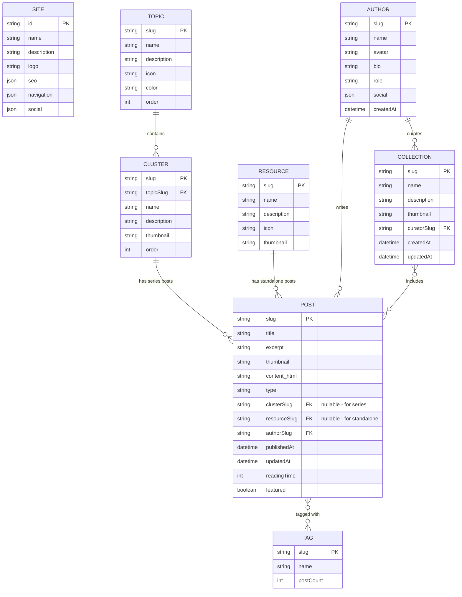
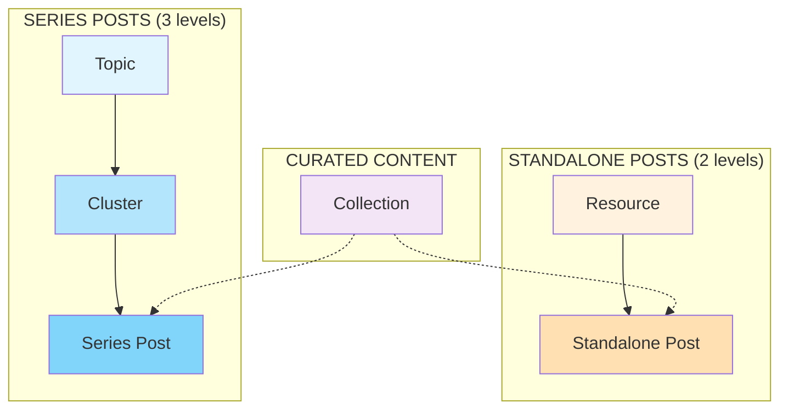
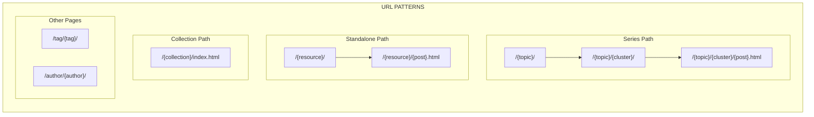
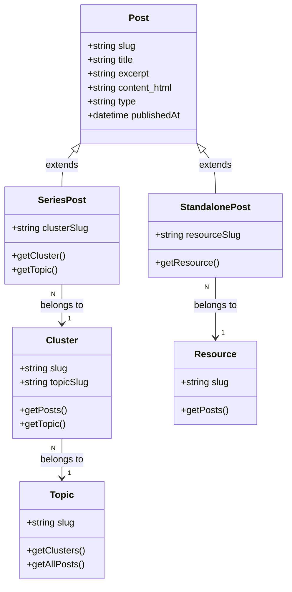
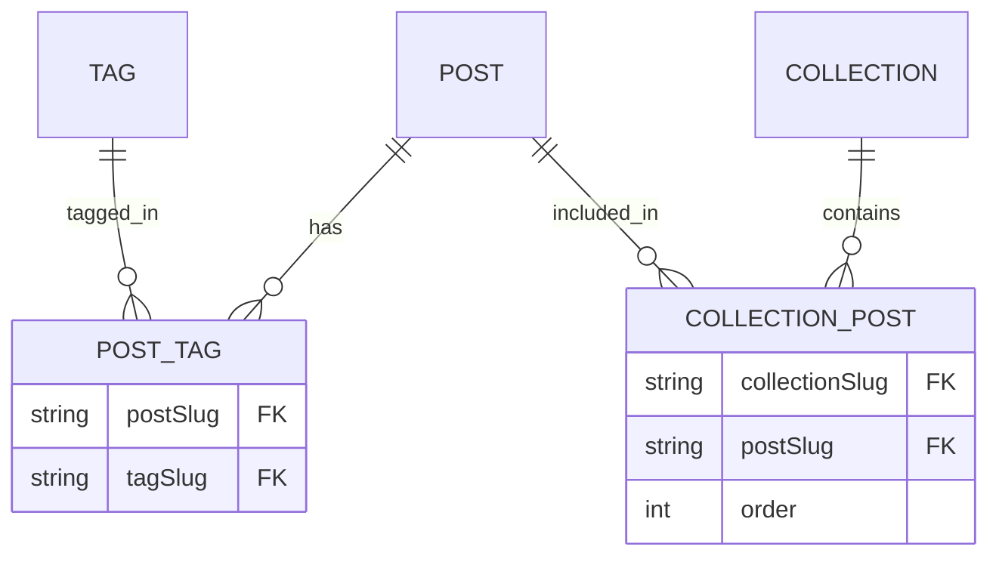
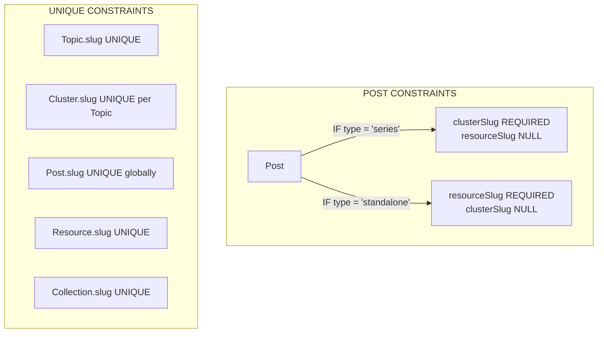
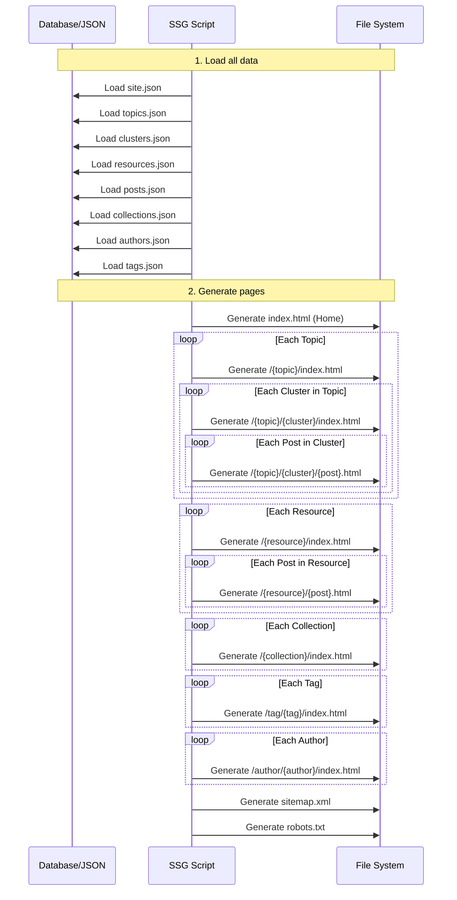

# Sơ đồ EER (Enhanced Entity-Relationship)

## Tổng quan mối quan hệ



## Chi tiết các mối quan hệ

### 1. Phân cấp Nội dung (Content Hierarchy)



### 2. URL Pattern theo Entity



### 3. Post Types & Relationships



### 4. Many-to-Many Relationships



## Bảng tóm tắt quan hệ

| Entity A | Relationship | Entity B | Cardinality | Mô tả |
|----------|-------------|----------|-------------|-------|
| Topic | contains | Cluster | 1:N | Mỗi Topic có nhiều Cluster |
| Cluster | has | Post (series) | 1:N | Mỗi Cluster có nhiều bài viết series |
| Resource | has | Post (standalone) | 1:N | Mỗi Resource có nhiều bài viết standalone |
| Author | writes | Post | 1:N | Mỗi Author viết nhiều bài |
| Author | curates | Collection | 1:N | Mỗi Author có thể tạo nhiều Collection |
| Post | tagged_with | Tag | M:N | Bài viết có nhiều tag, tag gắn nhiều bài |
| Collection | includes | Post | M:N | Collection chứa nhiều bài, bài nằm trong nhiều collection |

## Entity Constraints



## Data Flow khi Generate Static Site



## Physical Schema (nếu dùng SQL Database)

```sql
-- Topics table
CREATE TABLE topics (
    slug VARCHAR(100) PRIMARY KEY,
    name VARCHAR(255) NOT NULL,
    description TEXT,
    icon VARCHAR(50),
    color VARCHAR(7),
    "order" INT DEFAULT 0
);

-- Clusters table
CREATE TABLE clusters (
    slug VARCHAR(100) PRIMARY KEY,
    topic_slug VARCHAR(100) NOT NULL REFERENCES topics(slug),
    name VARCHAR(255) NOT NULL,
    description TEXT,
    thumbnail VARCHAR(500),
    "order" INT DEFAULT 0
);

-- Resources table
CREATE TABLE resources (
    slug VARCHAR(100) PRIMARY KEY,
    name VARCHAR(255) NOT NULL,
    description TEXT,
    icon VARCHAR(50),
    thumbnail VARCHAR(500)
);

-- Authors table
CREATE TABLE authors (
    slug VARCHAR(100) PRIMARY KEY,
    name VARCHAR(255) NOT NULL,
    avatar VARCHAR(500),
    bio TEXT,
    role VARCHAR(100),
    social JSONB,
    created_at TIMESTAMP DEFAULT NOW()
);

-- Posts table
CREATE TABLE posts (
    slug VARCHAR(200) PRIMARY KEY,
    title VARCHAR(500) NOT NULL,
    excerpt TEXT,
    thumbnail VARCHAR(500),
    content_html TEXT NOT NULL,
    type VARCHAR(20) NOT NULL CHECK (type IN ('series', 'standalone')),
    cluster_slug VARCHAR(100) REFERENCES clusters(slug),
    resource_slug VARCHAR(100) REFERENCES resources(slug),
    author_slug VARCHAR(100) NOT NULL REFERENCES authors(slug),
    published_at TIMESTAMP NOT NULL,
    updated_at TIMESTAMP,
    reading_time INT,
    featured BOOLEAN DEFAULT FALSE,
    
    -- Constraint: series posts must have cluster, standalone must have resource
    CONSTRAINT post_type_check CHECK (
        (type = 'series' AND cluster_slug IS NOT NULL AND resource_slug IS NULL) OR
        (type = 'standalone' AND resource_slug IS NOT NULL AND cluster_slug IS NULL)
    )
);

-- Tags table
CREATE TABLE tags (
    slug VARCHAR(100) PRIMARY KEY,
    name VARCHAR(255) NOT NULL
);

-- Post-Tag junction table (M:N)
CREATE TABLE post_tags (
    post_slug VARCHAR(200) REFERENCES posts(slug) ON DELETE CASCADE,
    tag_slug VARCHAR(100) REFERENCES tags(slug) ON DELETE CASCADE,
    PRIMARY KEY (post_slug, tag_slug)
);

-- Collections table
CREATE TABLE collections (
    slug VARCHAR(100) PRIMARY KEY,
    name VARCHAR(255) NOT NULL,
    description TEXT,
    thumbnail VARCHAR(500),
    curator_slug VARCHAR(100) REFERENCES authors(slug),
    created_at TIMESTAMP DEFAULT NOW(),
    updated_at TIMESTAMP
);

-- Collection-Post junction table (M:N with order)
CREATE TABLE collection_posts (
    collection_slug VARCHAR(100) REFERENCES collections(slug) ON DELETE CASCADE,
    post_slug VARCHAR(200) REFERENCES posts(slug) ON DELETE CASCADE,
    "order" INT DEFAULT 0,
    PRIMARY KEY (collection_slug, post_slug)
);

-- Indexes for performance
CREATE INDEX idx_posts_cluster ON posts(cluster_slug);
CREATE INDEX idx_posts_resource ON posts(resource_slug);
CREATE INDEX idx_posts_author ON posts(author_slug);
CREATE INDEX idx_posts_published ON posts(published_at DESC);
CREATE INDEX idx_clusters_topic ON clusters(topic_slug);
```

## View Diagram trên các công cụ

Bạn có thể copy các đoạn Mermaid code ở trên và paste vào:

1. **Mermaid Live Editor**: https://mermaid.live
2. **dbdiagram.io**: https://dbdiagram.io (cho SQL schema)
3. **draw.io**: https://draw.io (export SVG từ Mermaid)
4. **VS Code**: Cài extension "Markdown Preview Mermaid Support"
